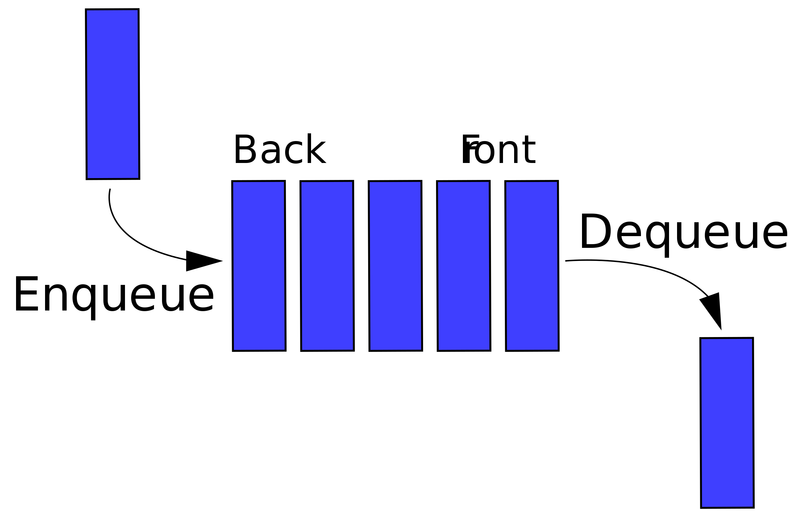

# Intro to Algorithms and Data Structures

## Goals

* Know what an algorithm is.
* Know what a data structure is.
* Know what a tree is.
* Know what DFS and BFS are

This class won't focus heavily on abstract algorithms: we will not
become experts in every algorithm under the sun. We are going to cover
the basic algorithms that *will* prove useful in your career.

Coding up algorithms is a good way to practice the skills we've been
learning. It gives you practice thinking like a programmer. Given a
description of an algorithm, you should be able to translate it into
Ruby code. That's our primary goal in this chapter.

## Abstract Data Types

### Trees

Ruby provides an Array class which is a "linear" collection of
elements. But there are other ways to represent collections and
organize data.

[**Trees**](http://en.wikipedia.org/wiki/Tree_data_structure) store data in a *hierarchy* of layers. An element,
or **node** at each layer can have links to lower level nodes. One simple example is a file system:

    * /
        * Users
            * ruggeri
                * Desktop
                * Documents
                * Downloads
            * patel
                * Desktop
                * Downloads
        * System
            * Library

The top-level node is called the **root**. Each node can hold a value:
here the root holds `/`. The **children** of a node are the nodes one
level deeper. The children of the `Users` node hold `ruggeri` and
`patel`. The lowest level nodes (the ones with no children) are called
**leaves**.

In general, nodes can have any number of children. In the special case of **binary trees**, nodes can have at most two children. These children are called the **left** and **right** children.

An array and a tree are two kinds of **data structures**. A data structure is a way of storing and organizing data in a computer so that it can be used efficiently. Depending on how you will use the data, different data structures may be appropriate.

#### Implementations
##### Set
Has the following public methods:
  - `include?`
  - `<<`
  - `delete`

##### Map
Aka Dictionary. Has the following public methods:
  - `get`
  - `set`
  - `delete`

##### Unary Tree
Aka Linked list
Each node/vertex has at most one children.

##### Binary Tree
Each node/vertex has at most two children (hence binary). A child has at most one parent. The child being the base case can have no parent.

##### Ternay Tree
Each node/vertex has at most *three* children.

##### N-ary Tree
Aka polytree. Each node/vertex can have *N*  children.

### Stack
An [abstract data type](https://en.wikipedia.org/wiki/Abstract_data_type) that serves as a [collection](https://en.wikipedia.org/wiki/Collection_(computing)) of elements, with two principal operations:

- **push**, which adds an element to the collection, and
- **pop**, which removes the most recently added element that was not yet removed.

The order in which elements come off a stack gives rise to its alternative name, **LIFO** (**last in, first out**). Additionally, a [peek](https://en.wikipedia.org/wiki/Peek_(data_type_operation)) operation may give access to the top without modifying the stack. The name "stack" for this type of structure comes from the analogy to a set of physical items stacked on top of each other, which makes it easy to take an item off the top of the stack, while getting to an item deeper in the stack may require taking off multiple other items first.

### Queue
A [collection](https://en.wikipedia.org/wiki/Collection_(abstract_data_type)) in which the entities in the collection are kept in order and the principal (or only) operations on the collection are the addition of entities to the rear terminal position, known as *enqueue*, and removal of entities from the front terminal position, known as *dequeue*. This makes the queue a [First-In-First-Out (FIFO) data structure](https://en.wikipedia.org/wiki/FIFO_(computing_and_electronics)). In a FIFO data structure, the first element added to the queue will be the first one to be removed. This is equivalent to the requirement that once a new element is added, all elements that were added before have to be removed before the new element can be removed. Often a *peek* or *front* operation is also entered, returning the value of the front element without dequeuing it. A queue is an example of a [linear data structure](https://en.wikipedia.org/wiki/Linear_data_structure), or more abstractly a sequential collection.

Queues provide services in [computer science](https://en.wikipedia.org/wiki/Computer_science), [transport](https://en.wikipedia.org/wiki/Transport), and [operations research](https://en.wikipedia.org/wiki/Operations_research) where various entities such as data, objects, persons, or events are stored and held to be processed later. In these contexts, the queue performs the function of a [buffer](https://en.wikipedia.org/wiki/Buffer_(computer_science)).

Queues are common in computer programs, where they are implemented as data structures coupled with access routines, as an [abstract data structure](https://en.wikipedia.org/wiki/Abstract_data_structure) or in object-oriented languages as classes. Common implementations are [circular buffers](https://en.wikipedia.org/wiki/Circular_buffer) and [linked lists](https://en.wikipedia.org/wiki/Linked_list).

## Algorithm

DFS and BFS are algorithms. What's the difference between an
algorithm and a method? An algorithm is an idea, an unambiguous but
unrealized process that solves a problem and which potentially could
be written in any language. A method is the implementation, a
conversion of an algorithm into Ruby code which can then be run.

An algorithm can be coded up in any language.

### Depth First Search ([DFS][dfs])

Given a tree, we may wish to enumerate all the values held by nodes in
the tree. For instance, we may wish to go through the files/folders of
the tree and print each one.

One common way to traverse (i.e., visit all the nodes) a tree is depth
first search. The nodes are numbered in the order that we visit them:

          1
         / \
        2   5
       /   / \
      3   6   9
     /   / \
    4   7   8

Each time, we try to visit the left child, if it exists and hasn't
been visited yet. If it has, we try to visit the right child, if it
exists and hasn't been visited yet. If all the children have been
visited, then we move up one level and repeat.

### Breadth first search ([BFS][bfs])

Breadth first search is an alternative to depth-first search.

          1
         / \
        2   3
       /   / \
      4   5   6
     /   / \
    7   8   9

Here we visit a node, then each of its children, then each of their children, etc. An advantage of breadth-first search is that it considers shallower nodes before deeper ones.

## References

* Wikipedia: [Data structure](http://en.wikipedia.org/wiki/Data_structure)
* Wikipedia: [Algorithm](http://en.wikipedia.org/wiki/Algorithm)
[dfs]: http://en.wikipedia.org/wiki/Depth-first_search
[bfs]: http://en.wikipedia.org/wiki/Breadth-first_search