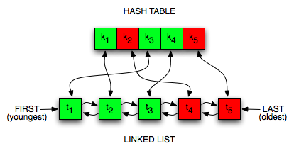

# MyHashMap #2

## Phase 6: LRU Cache

Let's upgrade your hash map to make an LRU Cache.

LRU stands for *Least Recently Used*. It's basically a cache of the `n` most-recently-used items. In other words, if something doesn't get looked at often enough, we trash it. It could be web pages, objects in memory on a video game, or kitty toys. But it's usually not kitty toys.

[Read more about it here](https://www.geeksforgeeks.org/lru-cache-implementation/).

If you're confused, that's okay. Just follow these basic principles, and you'll be fine.

- Your cache will only hold `max` many items (you should be able to set the `max` upon initialize).
- When you retrieve or insert an item, you should mark that item as now being the most recently used item in your cache.
- When you insert an item, if the cache exceeds size `max`, delete the least recently used item. This keeps the cache size always at `max` or below.

So that's our caching strategy. But how do we actually build this thing? Well, an LRU cache is built using a combination of two data structures: a hash map, and a linked list.

This is how we'll use the linked list: Each node in the list will hold a cached object. We'll always add new nodes to the end of the list, so the nodes at the end will always be the freshest, while those at the beginning are the oldest. Whenever an object is requested and found in the cache, it becomes the freshest item, so we'll need to move it to the end of the list to maintain that order.

Once the cache is full, we'll need to expire old entries too, so we'll remove items from the beginning since those are the oldest.

So just with that we've got a decent strategy for our LRU cache. Using a linked list, it's easy to add stuff, delete stuff, and to update its position among the most recently used items in our cache.

The only problem is lookup time. Linked lists are slow. If we want to figure out if an item is in the cache, we have to look at each node one-by-one; that's an `O(n)` traversal. That's not great. Let's see if we can augment this with a hash map to make it faster.

Here's the plan: we'll create a hash map whose keys will be the same keys that we put in our linked list. But unlike the linked list, our hash map won't store the values associated with those keys. Instead, the hash map will point to the *node object in our linked list* (if it exists). Every time we update the LRU cache by inserting or deleting an element, we'll insert it into our hash or delete it from our hash (which both take `O(1)` time).

We'll have two data structures to keep in sync now, which is a little more complicated. But the upside is that our hash map will allow us to jump into the middle of the linked list instantly, in `O(1)` time. That's awesome.

With this combination of data structures, we'll have `O(1)` lookup, insertion, and deletion for our cache. You can't ask for better.

So let's map the same data in both a hash map and in a linked list.

### Instructions:

- Let's say we're building an LRU cache that's going to cache the values of the perfect squares. So our LRU cache will store a `@prc`, which in this case will be `Proc.new { |x| x ** 2 }`. If we don't have the value of any number's square, we'll use this Proc to actually compute it. But we don't want to compute it for the same number twice, so after I compute anything, I'll store it in my LRU cache. But if my LRU Cache gets an input that doesn't exist in the cache, it'll compute it using the Proc.
- Now build your LRU cache. Every time you add a new key-value pair to your cache, you'll take two steps.
  - First, look to see if the key points to any node in your hash map. If it does, that means that the item exists in your cache. Before you return the value from the node though, move the node to the very end of the list (since it's now the most recently used item).
  - Say the key isn't in your hash map. That means it's not in your cache, so you need to compute its value and then add it. That has two parts.
    - First, you call the proc using your key as input; the output will be your key's value. Append that key-value pair to the linked list (since, again, it's now the most recently used item). Then, add the key to your hash, along with a pointer to the new node. Finally, you have to check if the cache has exceeded its `max` size. If so, call the`eject!` function, which should delete the least recently used item so your LRU cache is back to `max` size.
    - Hint: to delete that item, you have to delete the *first* item in your linked list, and delete that key from your hash. Implemented correctly, these should both happen in `O(1)` time.

And you did it! Congratulations! Celebrate by getting a **code review**!

