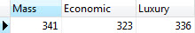

# [PostgreSQL CASE](http://www.postgresqltutorial.com/postgresql-case/)

In this tutorial, we will show you how to use the **PostgreSQL CASE** conditional expression to form conditional query.

## General Expression

The PostgreSQL CASE expression is the same as `IF/ELSE` statement in other programing languages. PostgreSQL provides two forms of the `CASE` expression. The following illustrates the general form of the `CASE` statement:

```sql
CASE
     WHEN condition_1  THEN result_1
     WHEN condition_2  THEN result_2
     [WHEN ...]
     [ELSE result_n]
END
```

In this general form, each condition is an expression that returns a boolean value, either `true` or `false`. If the condition evaluates to true, it returns the result which follows the condition, and all other `CASE` branches do not process at all. If all conditions evaluate to false, the `CASE` expression will return the result in the `ELSE` part. If you omit the `ELSE` clause, the `CASE` expression will return null.

Notice that all result expressions must have data types that can be convertible to a single data type e.g., string, numeric, etc.

Let’s take a look at the film table. Suppose you want to assign a price segment to a film as:

- mass if the rental rate is 0.99
- economic if the rental rate is 1.99
- luxury if the rental rate is 4.99

And you want to know the number of films that belongs mass, economic or luxury price segment. In this case, you can use the `CASE` expression to construct the query as follows:

```sql
SELECT
 SUM (
 CASE
 WHEN rental_rate = 0.99 THEN
 1
 ELSE
 0
 END
 ) AS "Mass",
 SUM (
 CASE
 WHEN rental_rate = 2.99 THEN
 1
 ELSE
 0
 END
 ) AS "Economic",
 SUM (
 CASE
 WHEN rental_rate = 4.99 THEN
 1
 ELSE
 0
 END
 ) AS "Luxury"
FROM
 film;
```

The result of the query is as follows:



We used CASE expression to return 1 or 0 if the rental rate meets the requirement. And then we applied [SUM function](http://www.postgresqltutorial.com/postgresql-sum-function/) to calculate the total of films for each price segment.

## Simple Expression

PostgreSQL provides another form of the `CASE` expression called simple form as follows:

```sql
CASE expression
WHEN value_1 THEN
 result_1
WHEN value_2 THEN
 result_2
[WHEN ...]
ELSE
 result_n
END;
```

PostgreSQL first evaluates the expression and then compare it with each value in the `WHEN` clause until it finds the value that matches the returned value of the expression. If PostgreSQL does not find any matches, it returns the `result_n` in the `ELSE` part, or `NULL` value if the `ELSE` part is omitted. This is similar to the `switch` statement in other programming languages such as C/C++, Java, etc.

We can rewrite the general `CASE` expression using the simple one as follows:

```sql
SELECT
 SUM (
 CASE rental_rate
 WHEN 0.99 THEN
 1
 ELSE
 0
 END
 ) AS "Mass",
 SUM (
 CASE rental_rate
 WHEN 2.99 THEN
 1
 ELSE
 0
 END
 ) AS "Economic",
 SUM (
 CASE rental_rate
 WHEN 4.99 THEN
 1
 ELSE
 0
 END
 ) AS "Luxury"
FROM
 film;
```

It produces the same result.


In this tutorial, you have learned how to use both forms of PostgreSQL CASE expression to form complex query.