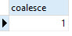
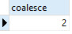
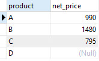
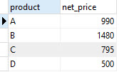

# PostgreSQL COALESCE

In this tutorial, you will learn about the PostgreSQL `COALESCE` function that returns the first non-null argument. You will learn how to apply this function in [`SELECT` statement ](http://www.postgresqltutorial.com/postgresql-select/)to handle null values effectively.

## Function syntax

The syntax of the `COALESCE` function is as follows:

```
COALESCE (argument_1, argument_2, …);
```

The `COALESCE` function accepts an unlimited number of arguments. It returns the first argument that is not null. If all arguments are null, the `COALESCE` function will return null.

The `COALESCE` function evaluates arguments from left to right until it finds the first non-null argument. All the remaining arguments from the first non-null argument are not evaluated.

The `COALESCE` function provides the same functionality as `NVL` or `IFNULL` function provided by SQL-standard. MySQL has [IFNULL function](http://www.mysqltutorial.org/mysql-ifnull/), while Oracle provides `NVL` function.

See the following examples:

```sql
SELECT
 COALESCE (1, 2);
```



```sql
SELECT
 COALESCE (NULL, 2 , 1);
```



We often use the `COLAESCE` function to substitute a default value for null values when we querying the data. For example, we want to display the excerpt from a blog post, if the excerpt is not provided, we can use the first 150 characters of the of the content of the post. To achieve this, we can use the `COALESCE`function as follows:

```sql
SELECT
 COALESCE (excerpt, LEFT(CONTENT, 150))
FROM
 posts;
```

## PostgreSQL COALESCE example

Let’s take a look at an example of using `COALESCE` function. First, we create a table named items using [`CREATE TABLE` statement](http://www.postgresqltutorial.com/postgresql-create-table/) as follows:

```
CREATE TABLE items (
 ID serial PRIMARY KEY,
 product VARCHAR (100) NOT NULL,
 price NUMERIC NOT NULL,
 discount NUMERIC
);
```

There are four fields in the `items` table:

- id: the primary key that identifies the item in the items table.
- product: the product name.
- price: the price of the product.
- discount: the discount of the product.

Second, we insert some records into the items table using [INSERT statement ](http://www.postgresqltutorial.com/postgresql-insert/)as follows:

```sql
INSERT INTO items (product, price, discount)
VALUES
 ('A', 1000 ,10),
 ('B', 1500 ,20),
 ('C', 800 ,5),
 ('D', 500, NULL);
```

Third, we query the net prices of the products using the following formula:

```sql
net_price = price - discount;
```
```sql
SELECT
 product,
 (price - discount) AS net_price
FROM
 items;
```



If you look at the fourth row, you will notice that the net price of the product `D` is null which seems not correct. The issue is the discount of the product `D` is null, therefore when we take the null value to calculate the net price, PostgreSQL returns null.

The get the right price, we need to assume that if the discount is null, it is zero. Then we can use the `COALESCE` function as follows:

```sql
SELECT
 product,
 (price - COALESCE(discount,0)) AS net_price
FROM
 items;
```



Now the net price of product `D` is `500` because we use zero instead of null value when we calculated the net price.

Besides using the `COALESCE` function, you can use the [CASE](http://www.postgresqltutorial.com/postgresql-case/) expression to handle the null values in this case. See the following query that uses the `CASE` expression to achieve the same result above.

```sql
SELECT
 product,
 (
 price - CASE
 WHEN discount IS NULL THEN
 0
 ELSE
 discount
 END
 ) AS net_price
FROM
 items;
```
In the query above we say if the discount is null then use zero (0) otherwise use discount value to in the expression that calculate the net price.

In terms of performance, `COALESCE` function and CASE expression are the same. We prefer `COALESCE`function than `CASE` expression because `COALESCE` function makes the query shorter and easier to read.

In this tutorial, you have learned how to use the `COALESCE` function to substitute null values in the query.