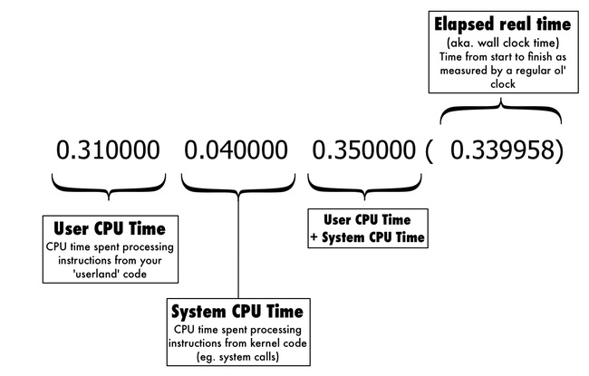

# Benchmarking

Ruby includes a Benchmark module in the standard library to test the execution time of code. This can be very useful if you need to approximate the real-world performance of different algorithms to determine which one is best for your particular application.

Use `Benchmark` to verify the **Big-O** performance of your various solutions. You can find the docs [here][benchmark-docs], and there's an example of how to use it in the [sorting complexity demo][sorting-demo] from the readings.

<!-- LINKS -->
[benchmark-docs]: https://devdocs.io/ruby~2.5/benchmark
[sorting-demo]: sorting_demo.rb#L58-L67

## Benchmark Ruby 101

Source: http://rubylearning.com/blog/2013/06/19/how-do-i-benchmark-ruby-code/

The simplest way to measure your Ruby code is with `Benchmark.measure`

```ruby
require 'benchmark'
require 'bigdecimal/math'

# calculate pi to 10k digits
puts Benchmark.measure { BigMath.PI(10_000) }
```

This will return something that looks like this:

```ruby
0.310000   0.040000   0.350000 (  0.339958)
```

**Generally, the number farthest to the right is the most important one.** It tells how long it actually took to perform the operation. If youre curious about why the clock time is so high, the other numbers can help you drill down to see if youre spending time in system functions or your own code.



Now that you know what those magic numbers mean, we can move on to the core `Benchmark` API. The truth is that I rarely use the `measure` method on its own. It only prints the benchmark for a single block of code. The most common way to use `Benchmark` is to compare the execution time of different approaches to the same problem. Benchmark has some built-in methods for this exact purpose.

#### Benchmark#bm

This method lets you define several blocks of code to benchmark, then prints the results side-by-side in the same format you saw earlier.

```ruby
require 'benchmark'

iterations = 100_000

Benchmark.bm do |bm|
  # joining an array of strings
  bm.report do
    iterations.times do
      ["The", "current", "time", "is", Time.now].join(" ")
    end
  end

  # using string interpolation
  bm.report do
    iterations.times do
      "The current time is #{Time.now}"
    end
  end
end
```
You call the `Benchmark#bm` method passing a block. The block variable is a special object provided by `Benchmark`. It gives you a `report` method that you call with the block of code that you want to measure. `Benchmark` then runs both blocks of code and prints their execution times side-by-side.

*A note about iterations:* Often, when doing benchmarks that test code that executes very quickly, you need to do many iterations to see a meaningful number. In this case, I did 100,000 iterations of each variant just to get the execution time up to half a second so I could grasp the difference.

The core API for `Benchmark#bm` is:

```ruby
Benchmark.bm do |bm|
  bm.report { first_approach }
  bm.report { alternative_approach }
end
```

#### Labels

In that last benchmark, I buried some comments in the source that said what each block of code was doing. Thats not so helpful when looking at the results! `Benchmark` allows you to pass in a label to the `report` method that will be printed along with the results.

```ruby
require 'benchmark'

iterations = 100_000
Benchmark.bm(27) do |bm|
  bm.report('joining an array of strings') do
    iterations.times do
      ["The", "current", "time", "is", Time.now].join(" ")
    end
  end

  bm.report('string interpolation') do
    iterations.times do
      "The current time is #{Time.now}"
    end
  end
end
```

Ive now removed the comments describing the blocks and pass them in to the `report` method as an argument. Now the output describes itself.

There’s one more important change I made in that last example that may have gone unnoticed. I passed `27` as an argument to the `Benchmark.bm` method. This signifies how much padding the header labels should have in the result output. If you pass labels to `report`, but dont set this value high enough, your output wont line up properly.

#### Benchmark#bmbm

The `Benchmark#bm` you just saw is really the core of `Benchmark`, but theres one more method I should mention: `Benchmark#bmbm`. Thats right its the same method name, repeated twice.

Sometimes, with a benchmark that creates a lot of objects, the results start to get skewed because of interactions with Rubys memory allocation or garbage collection routines. When creating a lot of objects, one block may need to run garbage collector, while the other doesnt; or just one block may get stuck with the cost of allocating more memory for Ruby to use.

In this case, the benchmark can produce unbalanced results. This is when you want to use `Benchmark#bmbm`.

The method name is suitable because it actually benchmarks your blocks of code twice. First, it runs the code as a ‘rehearsal to force any initialization that needs to happen, then it forces the GC to run, then it runs the benchmark again ‘for real. This ensures that the system is fully initialized and the benchmark is fair.

This last example benchmark allocates a lot of objects. When this runs at the rehearsal stage, Ruby has to allocate more memory to make room for all the objects. Then when the ‘real benchmark happens, the memory is already available and just the actual implementation is tested.

```ruby
require 'benchmark'

array = Array(1..10_000_000)

Benchmark.bmbm(7) do |bm|
  bm.report('reverse') do
    array.dup.reverse
  end

  bm.report('reverse!') do
    array.dup.reverse!
  end
end
```

And here is the result:

```ruby
Rehearsal --------------------------------------------
reverse    0.020000   0.020000   0.040000 (  0.050908)
reverse!   0.030000   0.020000   0.050000 (  0.048042)
----------------------------------- total: 0.090000sec

user     system      total        real
reverse    0.010000   0.000000   0.010000 (  0.015385)
reverse!   0.030000   0.000000   0.030000 (  0.023973)
```

#### Conclusion

When you want to try your hand at speeding up some of your Ruby code, make sure that you measure, measure, measure to prove that your new implementation is faster than the old one. This great little benchmarking library ships with Ruby right in the standard library, so theres no excuses!

---

## Benchmarking Ruby 101-2

Source: http://mitrev.net/ruby/2015/08/28/benchmarking-ruby/

Benchmarking Ruby code is essential for improving the performance of applications. The Ruby Standard Library provides a [Benchmark module](http://ruby-doc.org/stdlib-2.5.0/libdoc/benchmark/rdoc/Benchmark.html) that can be used to measure the running time of any Ruby code block.

First, lets require it:

```
require 'benchmark'
# => true
```

#### Benchmarking a single block of code

For benchmarking simple blocks of code, use the `#measure` method:

```ruby
puts Benchmark.measure { 10_000_000.times { Object.new } }
#        user     system      total        real
# => 1.280000   0.000000   1.280000 (  1.283235)
```

The result is in seconds, so instantiating 10 million objects takes a little more than a second.

If we need to print a custom message, we can capture the result and process it:

```ruby
result = Benchmark.realtime { 10_000_000.times { Object.new } }

puts "Creating ten million objects: #{realtime.round(2)}s"
# => Creating ten million objects: 1.29s
```

#### Comparing several blocks

We often need to compare several approaches to a problem in order to find out the best one. Let’s say we want to compare the following methods for finding the n-th fibonacci number:

```ruby
# DP version
def fib_dp(n)
  (2..n).reduce([0, 1]) { |m| m << m.last(2).reduce(:+) }[n]
end

# Recursive version
def fib_rec(n)
  return 0 if n == 0
  return 1 if n == 1

  fib_rec(n - 1) + fib_rec(n - 2)
end
```

The unoptimized recursive version is very slow and will choke on values larger than 40. We can use the `#bm` method to measure just how much slower it is:

```ruby
Benchmark.bm(10) do |x|
  x.report('dp:')        { fib_dp(35) }
  x.report('recursive:') { fib_rec(35) }
end

#                  user     system      total        real
# dp:          0.000000   0.000000   0.000000 (  0.000035)
# recursive:   1.680000   0.000000   1.680000 (  1.671631)
```

The first argument to `#bm` defines the label width and larger values will shift the results further to the right. Anyway, we got what we wanted - the recursive function takes more than a second and a half and the DP version takes a negligible amount of time. In fact, it can calculate very large fibonacci numbers in very little time:

```ruby
puts Benchmark.measure { fib_dp(100_000) }
#        user     system      total        real
# => 0.350000   0.000000   0.350000 (  0.350249)
```

There is another method in the Benchmark library called `#bmbm` which runs the tests twice - the first time to warm up the runtime environment and the second time to measure the results. You will want to use this method if you worry that the order of execution of the different code blocks will have an effect on their execution time.

#### Using benchmark-ips

The [benchmark-ips](https://github.com/evanphx/benchmark-ips) gem provides even more features than the default Benchmark module. Install it and then require it in your program:

```ruby
require 'benchmark/ips'
```

Let’s use it to test our previous methods:

```ruby
Benchmark.ips do |x|
  x.report('dp: ')        { fib_dp(35) }
  x.report('recursive: ') { fib_rec(35) }

  x.compare!
end

# Calculating -------------------------------------
#                 dp:      5.600k i/100ms
#          recursive:      1.000  i/100ms
# -------------------------------------------------
#                 dp:      60.299k (± 2.0%) i/s -    302.400k
#          recursive:       0.517  (± 0.0%) i/s -      3.000  in   5.800686s
#
# Comparison:
#                 dp: :    60299.5 i/s
#          recursive: :        0.5 i/s - 116590.15x slower
```

The only difference is the `x.compare!` call at the end, but we get a lot more valuable information about the performance of the two methods - iterations per second, standard deviation and finally a comparison which shows that the unoptimized recursive version is more than 100 000 times slower than the DP version!

There are a few more options available, like setting the time for the warmup and calculation phases or creating a custom suite.

#### Conclusion and further reading

If you ever wondered if `Enumerable#each` is faster than a `for` loop or if `[].map.flatten` is slower than `[].flat_map`, take a look at the [fast-ruby](https://github.com/JuanitoFatas/fast-ruby) repo. It contains answers to those questions and to many others.

The Benchmark module and benchmark-ips gem are really easy to use and provide great information about the performance of your code. They are an essential tool in every developers toolbelt.